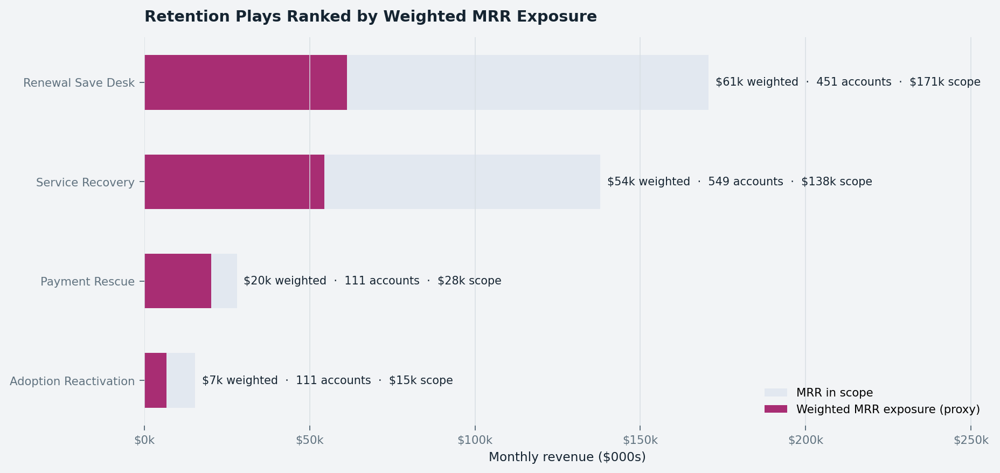

# Churn & Retention Intelligence

A SaaS retention analysis that measures churn, audits cohorts, and ranks open
accounts by behavioural risk adjusted for customer value.

**[Live dashboard](https://mfidalgomartins.github.io/churn-retention-intelligence/)**
&nbsp;&nbsp;·&nbsp;&nbsp;
**[PDF report](https://github.com/mfidalgomartins/churn-retention-intelligence/blob/main/outputs/reports/churn-retention-intelligence-report.pdf)**



The analysis covers **3,500 synthetic B2B SaaS accounts** through a
**2026-03-01 snapshot**. The main deliverable is a self-contained dashboard
with a prioritised account queue: which accounts to review first, why, and
with what intervention.

## What it does

```
generate → profile → features → analyze → risk → dashboard → validate
```

Every artifact is deterministic (seed 42), governed by data contracts, and
checked before release. The dashboard embeds its data and chart runtime and
works without a server or network connection.

## Quickstart

```bash
make install
make release
make quality
```

`make release` rebuilds the raw simulation, analytical outputs, validated
dashboard, chart pack, and PDF report. `make quality` runs lint, coverage, and
security/dependency checks.

## Governance

Production-facing release rules are documented under `docs/governance/`:

- `qa_release_framework.md` defines readiness states, severities, and gate outputs.
- `quality_security_gates.md` defines local and CI quality/security checks.
- `release_runbook.md` defines release verification and rollback steps.

Security reporting and support policy are in `SECURITY.md`.

## What the pipeline produces

| Layer | Output | Purpose |
|---|---|---|
| Raw | `data/raw/*.csv` | Simulated customers, subscriptions, weekly usage, payments |
| Features | `data/processed/customer_retention_features.csv` | Per-customer signals measured at churn date or the open-account snapshot |
| Analysis | `outputs/tables/main_analysis_*.csv` | Trends, drivers, revenue at risk, intervention plays |
| Risk | `data/processed/customer_risk_scores.csv` | Tiered priority queue with recommended actions |
| Dashboard | `outputs/dashboard/executive-retention-command-center.html` | Self-contained UI for executive review |
| Chart pack | `outputs/graphs/*.png` | Static charts; regenerate with `make charts` |
| Report | `outputs/reports/churn-retention-intelligence-report.pdf` | Narrative analysis with charts inline; `make report` |
| Governance | `outputs/tables/*validation*.csv`, `release_readiness_matrix.csv` | Release gates and audit log |

## Decisions it supports

- How monthly customer and revenue churn are moving.
- Which cohorts and commercial groups carry a disproportionate share of the loss.
- Which open accounts combine behavioural risk with material customer value.

## Architecture

```
src/churn/        pipeline modules (generate, profile, features, analyze, risk, dashboard, contracts, validate)
src/churn/common  shared constants and helpers (REFERENCE_DATE, SEED, snapshot inference, paths)
config/           data contracts and release policy
config/vendor_assets.json  vendored frontend asset versions and hashes
sql/              PostgreSQL 15+ reference models
docs/             methodology, governance, decision memo
outputs/          published dashboard, chart pack, and PDF report
tests/unit/       business-logic tests
tests/test_integration.py   end-to-end artifact and gate tests
```

Each module is invocable via `python -m churn.<name>` and reads its inputs from
governed locations only, with no module reaching outside its declared contract.

## Limits

Synthetic data, decision-support only. The risk score is a transparent
prioritisation index, not a calibrated churn probability. Revenue loss uses a
monthly-value proxy rather than contract ARR. Behavioural relationships are
associative, not causal.

## Tech

Python 3.11+, NumPy, pandas, vanilla JavaScript, and Chart.js.
