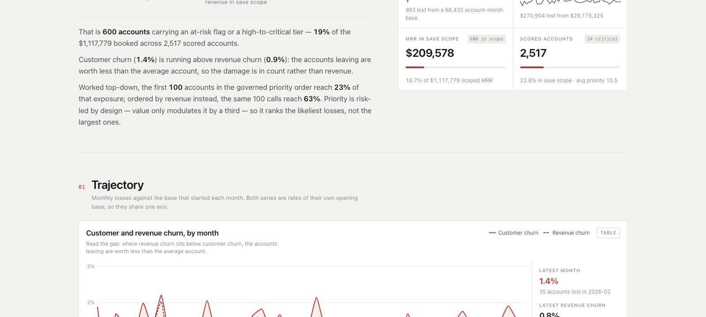
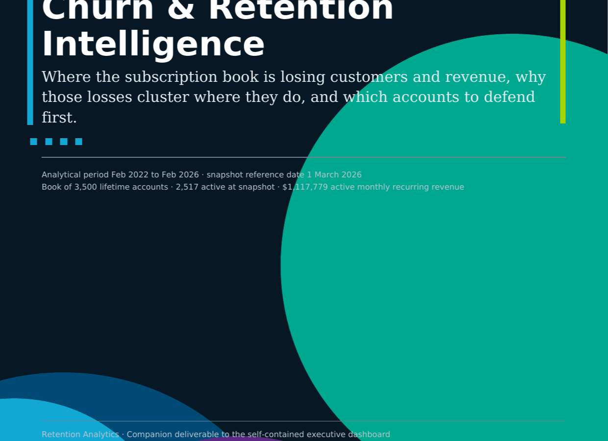
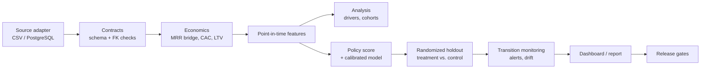

# Churn & Retention Intelligence

[](https://github.com/mfidalgomartins/churn-retention-intelligence/actions/workflows/ci.yml)
[](LICENSE)
[](pyproject.toml)

A production-shaped SaaS retention system that joins governed ingestion,
revenue economics, calibrated churn probabilities, randomized holdouts, and
operational risk monitoring in one reproducible pipeline.

**[Live dashboard](https://mfidalgomartins.github.io/churn-retention-intelligence/)**
&nbsp;&nbsp;·&nbsp;&nbsp;
**[PDF report](https://github.com/mfidalgomartins/churn-retention-intelligence/blob/main/outputs/reports/churn-retention-intelligence-report.pdf)**
&nbsp;&nbsp;·&nbsp;&nbsp;
**[Architecture](docs/architecture/pipeline_architecture.md)**
&nbsp;&nbsp;·&nbsp;&nbsp;
**[Quickstart](#quickstart)**
&nbsp;&nbsp;·&nbsp;&nbsp;
**[Docs](docs/README.md)**

The reference release covers 3,500 deterministic synthetic B2B SaaS accounts
through 2026-03-01. It is explicit about the boundary between demonstrated
engineering and real-world evidence: commercial values are proxies, model
performance is synthetic out-of-time evidence, and intervention outcomes are
identified as simulations.

## Flagship deliverables

**[Executive dashboard](https://mfidalgomartins.github.io/churn-retention-intelligence/)**
— a single self-contained HTML file with the governed data and chart runtime
embedded, no server required. Filterable by period, segment, region, channel,
plan, and risk tier; every number on the page ties back to a validation check
that runs at build time (57/57 shown in the header).

[](https://mfidalgomartins.github.io/churn-retention-intelligence/)

**[Narrative report](https://github.com/mfidalgomartins/churn-retention-intelligence/blob/main/outputs/reports/churn-retention-intelligence-report.pdf)**
— the companion decision-support document: where the book is losing customers
and revenue, why the losses cluster where they do, and which accounts to
defend first, generated from the same canonical outputs as the dashboard.

<a href="https://github.com/mfidalgomartins/churn-retention-intelligence/blob/main/outputs/reports/churn-retention-intelligence-report.pdf"></a>


## What ships



- CSV and PostgreSQL source adapters validate a complete batch before publishing
  canonical raw inputs.
- A contract-MRR event ledger reconciles new, expansion, contraction,
  reactivation, and churn movements to the subscription snapshot.
- A time-split logistic model is calibrated on an independent period and
  monitored against later outcomes and feature drift.
- Eligible high-risk accounts are assigned to treatment or holdout within risk
  tier and segment; incremental saved MRR is measured against control.
- Weekly automation creates content-addressed snapshots with per-file SHA-256
  evidence and 90-day artifact retention.

Current synthetic benchmark: out-of-time ROC AUC 0.823, Brier score 0.0344,
and 343 experiment-eligible accounts split 172 treatment / 171 holdout. The
simulated experiment produces an inconclusive -$131 saved-MRR estimate (95% CI
-$10,907 to $10,645). Reporting the null result is deliberate: the measurement
design does not manufacture uplift when evidence is insufficient.

## Quickstart

```bash
make install
make release
make quality
```

`make release` rebuilds every governed artifact, validates it, renders the
dashboard and PDF, and publishes an immutable snapshot. `make quality` runs
Ruff, mypy, the full unit/integration suite with branch coverage, Bandit, and
dependency audit.

### Production inputs

CSV source:

```bash
make production SOURCE_ADAPTER=csv \
  SOURCE_ARGS="--source-directory /path/to/export"
```

PostgreSQL source:

```bash
python -m pip install -e ".[warehouse]"
export CHURN_DATABASE_URL='postgresql+psycopg://...'
export CHURN_REFERENCE_DATE='YYYY-MM-DD'
make production SOURCE_ADAPTER=postgresql
```

Table mappings and schema live in `config/pipeline.yml`; credentials are read
only from environment variables. `make production` never runs the synthetic
generator or outcome simulator. Without `CHURN_INTERVENTION_OUTCOMES_FILE`, it
persists the randomized cohort with pending outcomes and publishes no effect
estimate. An observed outcome file must contain `customer_id`,
`assigned_action_delivered`, `churned_90d`, and `lost_mrr_90d`.
Ephemeral runners must set `CHURN_INTERVENTION_ASSIGNMENTS_FILE` to the durable
assignment ledger emitted by the first run; a missing configured ledger is a
blocking error rather than permission to re-randomize.
Set `CHURN_REFERENCE_DATE` to the source cutoff date and revise the temporal
split dates in `config/modeling.yml` when production history moves beyond the
reference demonstration windows.

## Core outputs

| Capability | Canonical output |
|---|---|
| Account features | `data/processed/customer_retention_features.csv` |
| Policy priority queue | `data/processed/customer_risk_scores.csv` |
| Calibrated probabilities | `data/processed/customer_churn_probabilities.csv` |
| Revenue movement bridge | `outputs/tables/revenue_movement_bridge.csv` |
| CAC, margin, payback, LTV | `outputs/tables/unit_economics_*.csv` |
| Experiment assignments/outcomes | `data/processed/intervention_*.csv` |
| Incremental effect estimates | `outputs/tables/intervention_incrementality.csv` |
| Risk transitions and alerts | `outputs/tables/risk_tier_transition_*.csv`, `monitoring_alerts.csv` |
| Executable model bundle | `outputs/models/churn_probability_model.joblib` |
| Executive dashboard | `outputs/dashboard/executive-retention-command-center.html` |
| Narrative report | `outputs/reports/churn-retention-intelligence-report.pdf` |
| Release evidence | `outputs/tables/*validation*.csv`, `release_readiness_matrix.csv` |

Generated working data and tables are intentionally ignored by Git and rebuilt
in CI. Published dashboard, chart, report, and model artifacts are versioned.

## Architecture and methods

- [Pipeline architecture](docs/architecture/pipeline_architecture.md)
- [Probability model](docs/methodology/probability_model.md)
- [Revenue and unit economics](docs/methodology/unit_economics.md)
- [Experimentation and incrementality](docs/methodology/experimentation.md)
- [Production operations](docs/governance/production_operations.md)
- [Release runbook](docs/governance/release_runbook.md)

The transparent policy score and calibrated model are separate decision tools.
The first encodes operational priority and recommended actions; the second
estimates a 90-day probability and is subject to calibration and drift gates.

## Repository map

```text
src/churn/        pipeline and governance modules
config/           source, economics, model, experiment, monitoring, and contract policy
sql/              PostgreSQL 15+ reference transformations
docs/             architecture, methodology, operations, and executive memo
outputs/          published dashboard, graphs, model bundle, and PDF
tests/            business logic, failure paths, and end-to-end release assertions
```

## Limits

- The bundled dataset and forward intervention outcomes are synthetic.
- Recurring-value and gross-margin measures are analytical proxies, not GAAP
  revenue or audited cost accounting.
- Repeated customer-month observations mean model metrics are descriptive
  out-of-time results, not independent-sample confidence intervals.
- A live deployment must replace simulated outcomes, confirm source semantics,
  recalibrate probabilities, and set alert thresholds against operating history.

## Roadmap

Ordered by what would need to change first to run this against a live book:

- Replace the synthetic generator's outcome file with observed 90-day results
  from a real intervention program, so `intervention_incrementality.csv`
  reports a measured effect instead of a simulated one.
- Add a second source adapter validated against a live warehouse schema
  (current PostgreSQL coverage is reference SQL, not a tested connector).
- Extend `monitor.py` alert thresholds with a burn-in period against real
  operating history before they gate a release.
- Swap the analytical margin proxy in `economics.py` for a cost allocation
  reconciled to finance's chart of accounts.

## Stack

Python 3.11-3.14, pandas, NumPy, scikit-learn, PostgreSQL reference SQL,
vanilla JavaScript, and Chart.js.
