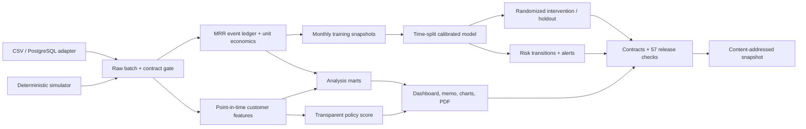

# Pipeline Architecture

The system separates source publication, analytical transformation, decision
logic, and presentation. A failed contract, model gate, experiment balance
check, or release validation stops publication before the dashboard is rebuilt.

## Execution paths

| Path | Command | Source behaviour |
|---|---|---|
| Reference release | `make release` | Regenerates the fixed synthetic source |
| Production batch | `make production SOURCE_ADAPTER=...` | Ingests validated external tables; never calls the simulator |
| Working pipeline | `make pipeline` | Uses the raw batch already published |
| Immutable snapshot | `make snapshot` | Packages current raw, processed, model, and table outputs |

## Module boundaries

- `ingest.py` reads all configured sources into memory, validates required
  columns, keys, domains, ranges, dates, and foreign keys, then publishes each
  file with an atomic replace and a checksum manifest.
- `economics.py` owns recurring-value movements, direct service costs, and
  unit-economics definitions.
- `snapshots.py` owns point-in-time customer-month observations and label
  availability. Future events cannot enter feature windows.
- `modeling.py` owns temporal training, separate calibration, performance,
  drift, scoring, and the executable model bundle.
- `experiments.py` owns eligibility, stratified assignment, holdout integrity,
  outcome monitoring, and intention-to-treat estimates. Synthetic outcomes are
  permitted only for the synthetic adapter; external adapters publish pending
  or observed outcomes.
- `monitor.py` owns portfolio tier migration, complete-month transitions,
  outcome calibration, drift exclusions, and alerts.
- `contracts.py` and `validate.py` are blocking publication gates.

The dashboard reads governed processed outputs only. Its visual design and
interaction layer are independent from source-adapter and model execution.
